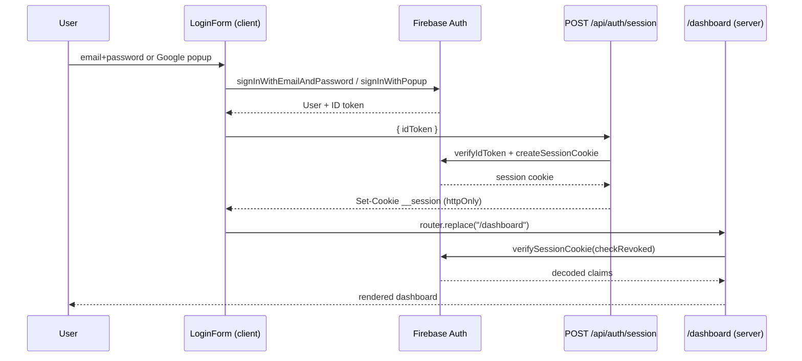

# Firebase Authentication - Angular to Next.js Port

Record of the migration of the legacy Angular login (`src/`) to the Next.js 16 App Router (`app/`).

- **Date:** 2026-09-25
- **Branch:** `feature/4`
- **Stack:** Next.js 16.3.6 (App Router, Turbopack), React 19.2.8, Tailwind CSS v4, TypeScript 5 (strict)

---

## 1. What was replaced

| Angular (deleted) | Next.js (new) |
| --- | --- |
| `src/app/core/config/firebase.config.ts` | `lib/firebase/client.ts` |
| `src/app/core/services/auth.service.ts` (`currentUser` signal) | `lib/auth/auth-context.tsx` (`AuthProvider` + `useAuth()`) |
| `src/app/app.ts` / `app.html` (login form, Google button, profile, API call) | `app/login/login-form.tsx`, `app/dashboard/*` |
| `src/environments/environment.ts` (hardcoded placeholders) | `.env.local` / `.env.example` |
| `src/app/app.routes.ts` (empty, no guards) | `proxy.ts` + server-side `getCurrentUser()` |
| _(none - no server side existed)_ | `lib/firebase/admin.ts`, `lib/auth/session.ts`, `app/api/auth/session/route.ts` |

The entire `src/` folder was removed after the port was verified.

---

## 2. Architecture

Sign-in happens **in the browser** with the Firebase Web SDK. The resulting ID token is exchanged
server-side for an **httpOnly session cookie** minted by the Firebase Admin SDK. Server Components
verify that cookie on every request, which is what actually authorizes access.



### Two layers of protection

1. **`proxy.ts` - optimistic only.** Checks nothing but the *presence* of the `__session` cookie so it
   can redirect cheaply before rendering. It never imports `firebase-admin` (Node-only) and is not
   treated as authorization.
2. **Server Components - authoritative.** `getCurrentUser()` calls `verifySessionCookie(cookie, true)`.
   A forged or revoked cookie resolves to `null` and the page redirects.

---

## 3. Files

### `lib/firebase/client.ts`
Browser SDK. Reads the six `NEXT_PUBLIC_FIREBASE_*` variables and exports `firebaseAuth()` and
`googleProvider()` as **functions**, not module-level constants.

### `lib/firebase/admin.ts`
Admin SDK. Builds credentials from `FIREBASE_PROJECT_ID`, `FIREBASE_CLIENT_EMAIL` and
`FIREBASE_PRIVATE_KEY` (literal `\n` sequences are unescaped). Marked `server-only`; exports
`adminAuth()` lazily. `requireEnv()` throws a named error for any missing variable.

### `lib/auth/constants.ts`
Only `SESSION_COOKIE = "__session"`. Exists as its own module so `proxy.ts` can import the name
without dragging `firebase-admin` into the proxy bundle.

### `lib/auth/session.ts`
Server-only session helpers:

- `createSession(idToken)` - verifies the ID token, mints a 5-day session cookie, writes it with
  `httpOnly`, `sameSite: "lax"`, `path: "/"`, and `secure` in production.
- `getCurrentUser()` - verifies with `checkRevoked: true`, returns `SessionUser | null`, swallowing
  all verification failures.
- `clearSession()` - revokes the user's refresh tokens, then deletes the cookie.

### `lib/auth/auth-context.tsx`
`AuthProvider` subscribes to `onAuthStateChanged` and exposes `{ user, loading }` through `useAuth()`.
Direct replacement for the Angular `currentUser` signal. Mounted in `app/layout.tsx`.

### `lib/auth/auth-errors.ts`
Maps Firebase error codes (`auth/invalid-credential`, `auth/email-already-in-use`,
`auth/popup-closed-by-user`, `auth/weak-password`, and others) to user-facing strings. Unknown codes
fall back to a generic message so raw SDK errors never reach the UI.

### `app/api/auth/session/route.ts`
- `POST` - validates the JSON body, rejects a missing or non-string `idToken` with 400, returns 401 on
  verification failure, and otherwise sets the cookie and returns the user.
- `DELETE` - clears the session and returns 204.

### `proxy.ts`
Redirects `/dashboard*` to `/login` when the cookie is absent, and `/login` to `/dashboard` when it is
present. Matcher excludes `api`, `_next/static`, `_next/image`, and `favicon.ico`.

### `app/login/page.tsx` + `app/login/login-form.tsx`
Server shell plus a client form with a Login/Register toggle, email and password fields, a
"Continue with Google" button, inline error text with `role="alert"`, and a disabled pending state.
Both flows funnel through one `startSession()` helper; if the session exchange fails it calls
`signOut()` so the client and server never disagree.

### `app/dashboard/*`
- `page.tsx` - server component; `getCurrentUser()` or redirect. Renders name, email, and avatar.
- `call-api-button.tsx` - ports the Angular `callApi()`: sends the ID token as
  `Authorization: Bearer` to `${NEXT_PUBLIC_API_BASE_URL}/hello` and pretty-prints the response.
- `logout-button.tsx` - `signOut()` then `DELETE /api/auth/session`, then redirect.

### Modified
- `app/page.tsx` - starter landing page replaced by an auth-based redirect.
- `app/layout.tsx` - wraps children in `AuthProvider`; fonts and metadata unchanged.
- `next.config.ts` - `images.remotePatterns` for `lh3.googleusercontent.com`.
- `.gitignore` - `!.env.example` so the template is committed while `.env*` stays ignored.

### Dependencies added
`firebase@^12.19.0`, `firebase-admin@^13.10.0`, `server-only@^0.0.1`.

---

## 4. Design decisions

**Lazy SDK initialization (both SDKs).** Initializing at module scope broke `next build`: page-data
collection evaluated `lib/firebase/admin.ts` and threw `Missing required environment variable`, and
prerendering `/_not-found` evaluated the browser SDK and threw `auth/invalid-api-key`. Exporting
`adminAuth()` and `firebaseAuth()` as functions defers initialization to request time.

**Logout is a client component, not a server action.** A server action can clear the cookie but cannot
clear the browser SDK's IndexedDB state, so `auth.currentUser` would remain populated and the
"Call /hello API" button would keep minting tokens. The client component signs out of both.

**`checkRevoked: true` on every verification.** Costs a lookup but makes logout and account disabling
take effect immediately rather than after the 5-day cookie lifetime.

**`SESSION_COOKIE` in its own module.** Importing it from `session.ts` would have pulled
`firebase-admin` and `server-only` into the proxy bundle.

---

## 5. Verification

`npx eslint .`, `npx tsc --noEmit`, and `npm run build` all pass.

```
Route (app)
┌ ƒ /
├ ○ /_not-found
├ ƒ /api/auth/session
├ ƒ /dashboard
└ ○ /login
ƒ Proxy (Middleware)
```

Manual checks to run once credentials are in place:

1. `/` while logged out redirects to `/login`.
2. Register a user; DevTools > Application > Cookies shows `__session` with `HttpOnly`.
3. Hard-refresh `/dashboard` - no flash of content, session verified server-side.
4. Google popup shows displayName, email, and avatar.
5. "Call /hello API" returns 200 from the backend.
6. Logout clears the cookie; `/dashboard` bounces back to `/login`.
7. Tamper the `__session` value - `/dashboard` redirects to `/login`.

---

## 6. Required before it runs

`.env.local` was created but is **empty**. The Angular config held placeholders
(`SUA_API_KEY`, `seu-projeto`), so nothing was migrated. Fill in from the Firebase Console:

| Variable | Source |
| --- | --- |
| `NEXT_PUBLIC_FIREBASE_*` (6) | Project settings > General > Your apps |
| `FIREBASE_PROJECT_ID` / `FIREBASE_CLIENT_EMAIL` / `FIREBASE_PRIVATE_KEY` | Project settings > Service accounts |
| `NEXT_PUBLIC_API_BASE_URL` | Backend origin, defaults to `https://localhost:5001` |

Keep `FIREBASE_PRIVATE_KEY` double-quoted with literal `\n` escapes. Enable the Email/Password and
Google providers under Authentication > Sign-in method.

---

## 7. Out of scope

Password reset, email verification, sign-up profile fields, role-based authorization, i18n,
automated tests, and Firestore.
